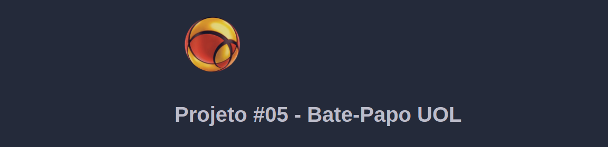
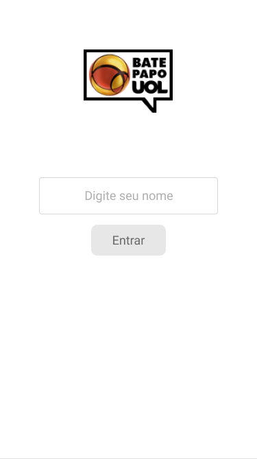
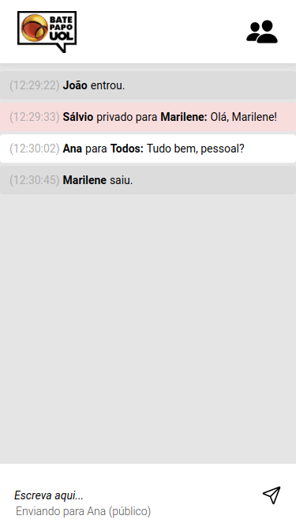

<h1 align="center">
    
</h1>

<h1 align="center">
    <a href="#">Bate Papo UOL</a>
</h1>

<h3 align="center">
    Brazil's most famous web chat.
</h3>

  
   
   

<h4 align="center"> 
	 Status: In Development...
</h4>

## About

Bate Papo UOL - is a free and secure way to connect with people.  
Project developed during ** Bootcamp Responde Aí ** offered by [Responde Aí](https://www.respondeai.com.br/).  
The focus of this project is to develop pure JavaScript skills and to start to learn backend technologies, with a mobile-focused layout.

---

## Features

- [ ] Login experience:
   - [ ] Checks if nickname is available
   - [ ] Loads previous messages
   - [ ] Loads list of active users

- [ ] Messaging experience
   - [x] Selects user/everyone to send a message
   - [x] Selects between private and public message
   - [ ] Auto scrolls messages
   - [ ] Send message on Enter

---

## Layout

The application layout is available on Figma:

### Mobile

  

  

### Pre-requisites

Before you begin, you will need to have the following tools installed on your machine:
[Git] (https://git-scm.com), [Node.js] (https://nodejs.org/en/).
In addition, it is good to have an editor to work with the code like [VSCode] (https://code.visualstudio.com/)

## Tech Used

The following tools were used in the construction of the project:

#### **Mobile**

-   **[HTML5](https://html5.org/)**
-   **[CSS3](https://www.w3.org/Style/CSS/Overview.en.html)**
-   **[Pure JavaScript](https://www.javascript.com/)**

#### **Server**  ([NodeJS](https://nodejs.org/en/))

-   ** Not yet **

#### **Utilitários**

-   Prototype:  **[Figma](https://www.figma.com/)**  →  **[Protótipo (Ecoleta)](https://www.figma.com/file/eviXSw3MnQVphvpalRT78c/Chat-UOL?node-id=0%3A1)**
-   Editor:  **[Visual Studio Code](https://code.visualstudio.com/)**
-   Icons:  **[Ion Icons](https://ionicons.com/)**
-   Fonts:  **[Roboto](https://fonts.google.com/specimen/Roboto)**

---

## Author

<a style="border-radius: 50%;" width="100px;" href="https://user-images.githubusercontent.com/31478895/114489151-08aa5d00-9be9-11eb-9d42-1ff1f1e85b6f.jpg">
 
  
 <b>Lucas de Morais</b></a>
  

 

---

## License

This project is under the license [MIT](./LICENSE).

Made with love by Lucas de Morais 👋🏽 [Get in Touch!](Https://www.linkedin.com/in/lucasmoraismt/)

---
